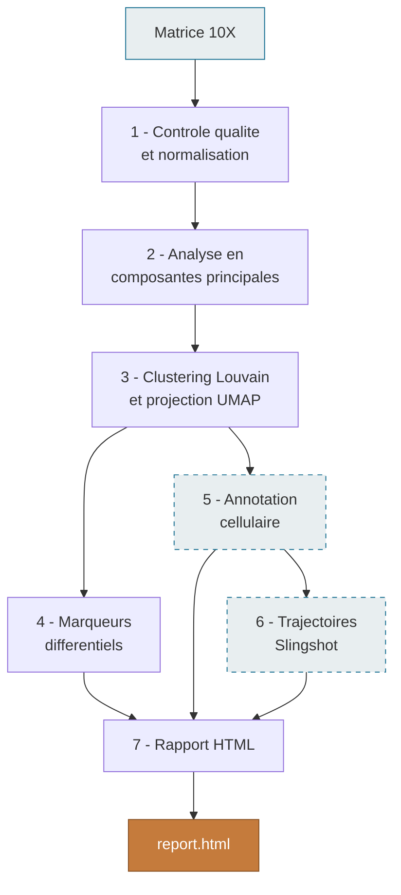

# scrnaseq_pipeline

Pipeline **Nextflow DSL2** reproductible et modulaire pour l'analyse complete de
donnees single-cell RNA-seq (10X Genomics), de la matrice de comptage brute au
rapport HTML consolide.

## Workflow

Les modules en pointilles sont optionnels et pilotes par la configuration.

## Modules

| Module | Etape | Sorties principales |
|---|---|---|
| 1 | Controle qualite et normalisation | Objet filtre, genes hautement variables |
| 2 | Analyse en composantes principales | Reduction ACP, selection des dimensions |
| 3 | Clustering et projection UMAP | Clusters, coordonnees UMAP |
| 4 | Marqueurs differentiels | Tables de marqueurs, figures d'expression |
| 5 | Annotation cellulaire | Types cellulaires, UMAP annote |
| 6 | Trajectoires cellulaires | Pseudotemps, genes dynamiques |
| 7 | Rapport HTML | Document consolide et navigable |

## Points de conception

**Configuration centralisee.** Aucun parametre scientifique n'est code en dur
dans les scripts : seuils, resolutions et methodes proviennent d'un unique
fichier YAML, qui constitue a lui seul l'enregistrement complet d'une analyse.

**Annotation automatisee.** L'attribution des identites cellulaires repose sur un
score de module confronte a une base de marqueurs canoniques externalisee, avec
un garde-fou qui etiquette `Unknown` tout cluster n'atteignant pas le seuil de
confiance plutot que de forcer une annotation douteuse.

**Rapport dynamique.** Le template RMarkdown derive l'integralite de ses chiffres
des sorties du pipeline et omet automatiquement les sections correspondant aux
modules non executes. Le document reste donc exact quel que soit le jeu de
donnees traite.

**Cache fiable.** Les scripts R sont declares comme entrees des process : toute
modification de code invalide le cache du module concerne et de ses dependants,
ce qui rend la reprise par `-resume` sure durant le developpement.

## Validation

Le pipeline a ete valide sur le jeu de donnees **PBMC 3k** de 10X Genomics par
comparaison a une analyse Seurat et Slingshot menee manuellement :

| Metrique | Analyse manuelle | Pipeline |
|---|---|---|
| Cellules retenues | 2 638 (97,7 %) | 2 638 (97,7 %) |
| Clusters identifies | 9 | 9 |
| Marqueurs differentiels | 3 446 | 3 446 |
| Types cellulaires annotes | 9 | 9, proportions identiques |
| Lignage lymphocytaire T | 1 451 cellules, 1 lignage | 1 451 cellules, 1 lignage |
| Pseudotemps median | 14,22 | 14,22 |

## Demarrage rapide

    # 1. Cloner le depot
    git clone https://github.com/romainkpakou/scrnaseq_pipeline.git
    cd scrnaseq_pipeline

    # 2. Installer l'environnement
    conda env create -f environment/environment.yml
    conda activate scrnaseq_pipeline

    # 3. Telecharger le jeu de donnees de demonstration (PBMC 3k, 7 Mo)
    bash bin/download_test_data.sh

    # 4. Lancer l'analyse
    nextflow run main.nf -profile conda \
        --config params/example_pbmc.yaml \
        --input_path data/raw/pbmc3k/hg19 \
        --output_path results

Le rapport consolide est produit dans `results/report.html`.

## Utilisation

    nextflow run main.nf -profile conda \
        --config params/example_pbmc.yaml \
        --input_path data/raw/pbmc3k/hg19 \
        --output_path results

Le profil `conda` garantit l'environnement reproductible. Sans lui, le pipeline
utilise le R du systeme, qui doit alors fournir toutes les dependances.

Consulter [docs/usage.md](docs/usage.md) pour les prerequis, les profils
d'execution (Conda, SLURM) et la resolution des problemes courants.

## Prerequis

Java 17, Nextflow (>= 22.04), R (>= 4.3) avec Seurat 5.x et Slingshot 2.x,
pandoc. L'environnement Conda fourni installe l'ensemble des dependances R :

    conda env create -f environment/environment.yml

## Architecture

    scrnaseq_pipeline/
    |-- main.nf                  workflow principal
    |-- nextflow.config          manifeste, profils, rapports de trace
    |-- modules/                 process Nextflow, un par etape
    |-- bin/                     scripts R parametrables
    |-- params/                  configurations d'analyse (YAML)
    |-- assets/                  bases de marqueurs, template de rapport
    +-- docs/                    documentation utilisateur

Chaque module associe un process Nextflow, qui gere l'orchestration et les
entrees-sorties, a un script R, qui porte la logique analytique. Cette
separation permet de tester chaque script independamment du pipeline.

## Auteur

Romain KPAKOU : M2 Bioinformatique, Biostatistique et Biologie Computationnelle.

## Licence

MIT
